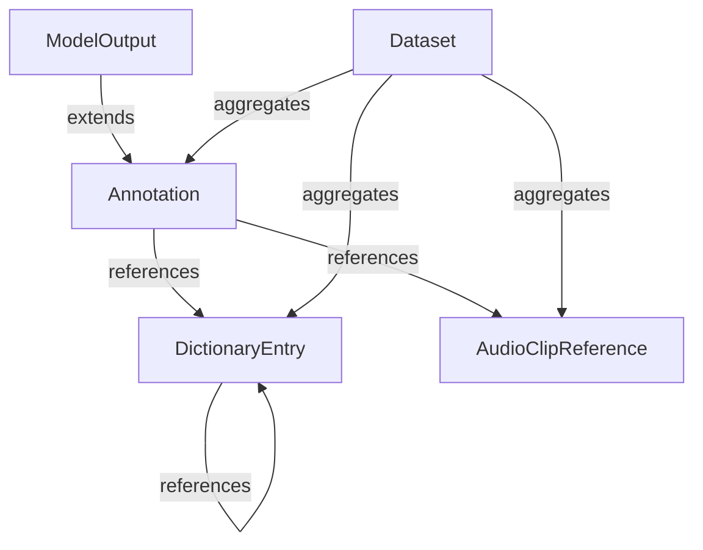

# Audio Description Protocol (ADP)

A spec-driven framework for describing musical audio clips with structured text annotations, enabling seamless interoperability between human annotators and AI models.

## 🎯 Project Overview

The Audio Description Protocol (ADP) creates standardized JSON schemas for musical audio annotation, supporting:

- **Dictionary Entries**: Hierarchical musical descriptors with unique IDs
- **Time-Based Annotations**: Labels with confidence scores and provenance tracking
- **Dataset Manifests**: Curated collections of clips and annotations
- **Model Outputs**: AI-generated annotations with inference metadata

### Key Features

- 📋 **JSON Schema Compliance**: All data exchange via versioned schemas
- 🏗️ **Hierarchical Labels**: Parent-child relationships for musical taxonomy
- 🕒 **Time Range Support**: Precise temporal annotations with validation
- 🤖 **Human-AI Interoperability**: Provenance tracking for annotation sources
- 📈 **Scalable**: Designed to handle up to 10,000 clips and annotations
- 🔄 **Version Control**: Semantic versioning for schema evolution

## 🚀 Quick Start

### Prerequisites

- Python 3.11 or higher
- Audio files (WAV/MP3 format)

### Installation

```bash
# Clone the repository
git clone <repository-url>
cd "Audio Description Protocol"

# Create virtual environment
python -m venv adp-env
source adp-env/bin/activate  # On Windows: adp-env\Scripts\activate

# Install dependencies (when implementation is complete)
pip install -e .
```

### Basic Usage

```bash
# Validate a dictionary entry
adp validate dictionary examples/lo-fi-hip-hop.json

# Validate an annotation
adp validate annotation examples/annotation-001.json

# Validate a complete dataset
adp validate dataset examples/study-music-dataset.json
```

## 📖 Documentation Structure

This project follows a **spec-driven development** approach using the Spec Kit framework:

```
📁 Audio Description Protocol/
├── 📋 spec.md                    # Main feature specification
├── 🏛️ .specify/                  # Spec Kit framework
│   ├── memory/constitution.md    # Project governance principles
│   └── templates/               # Development templates
├── 📂 specs/001-create-a-spec/   # Current feature implementation
│   ├── spec.md                  # Detailed requirements
│   ├── plan.md                  # Implementation plan
│   ├── research.md              # Technical decisions
│   ├── data-model.md            # Entity definitions
│   ├── contracts/               # JSON Schema files
│   ├── quickstart.md            # Integration scenarios
│   └── tasks.md                 # Implementation tasks (40 tasks)
└── 📊 progress.md                # Development progress log
```

## 🏗️ Architecture

### Entity Model



### Core Components

- **DictionaryEntry**: Musical descriptors with hierarchical relationships
- **Annotation**: Time-bound labels linking audio clips to dictionary entries
- **Dataset**: Curated collections with metadata and references
- **ModelOutput**: AI-generated annotations with inference metadata
- **AudioClipReference**: Standardized pointers to audio content

### Data Flow

1. **Dictionary Creation**: Define musical terms with hierarchical relationships
2. **Audio Annotation**: Apply labels to time ranges with confidence scores
3. **Dataset Assembly**: Aggregate clips, annotations, and dictionary entries
4. **Validation**: Ensure all data conforms to JSON Schema contracts
5. **AI Processing**: Generate model outputs with inference metadata

## 📋 Specification Overview

### Functional Requirements

- **FR-001**: Standardized schemas for dictionary entries
- **FR-002**: Annotation schema with time ranges and confidence
- **FR-003**: Dataset manifest support
- **FR-004**: Model output capture with metadata
- **FR-005**: Comprehensive validation system
- **FR-006**: Lowercase label standardization
- **FR-007**: Provenance tracking (human vs AI)
- **FR-008**: Versioned schema evolution
- **FR-009**: Time range validation
- **FR-010**: Confidence score validation [0.0, 1.0]
- **FR-011**: File path and web URL support
- **FR-012**: Hierarchical label relationships
- **FR-013**: CC0-1.0 default licensing
- **FR-014**: Last-writer-wins conflict resolution

### Scale Requirements

- **Target**: 10,000 audio clips and annotations
- **Performance**: Schema validation <100ms
- **Storage**: File-based JSON with optional database future support

## 🔧 JSON Schema Examples

### Dictionary Entry
```json
{
  "id": "lo-fi-hip-hop",
  "label": "lo-fi hip hop",
  "definition": "Relaxed hip hop subgenre characterized by low-fidelity sound quality, jazz samples, and downtempo beats.",
  "schema_version": "1.0",
  "parent_id": "hip-hop",
  "tags": ["chill", "instrumental", "study-music"],
  "created_at": "2025-09-26T10:00:00Z"
}
```

### Annotation
```json
{
  "id": "annotation-001",
  "clip_id": "sample-audio-001",
  "time_range": {
    "start_sec": 0.0,
    "end_sec": 30.0
  },
  "labels": [
    {
      "entry_id": "lo-fi-hip-hop",
      "confidence": 0.85
    }
  ],
  "provenance": {
    "annotator_type": "human",
    "annotator_id": "researcher-001",
    "timestamp": "2025-09-26T10:30:00Z"
  },
  "schema_version": "1.0"
}
```

## 🛠️ Development Status

### Current Phase: Planning Complete ✅

- [x] Constitution established (v1.0.0)
- [x] Feature specification with 14 requirements
- [x] Implementation plan with technical architecture
- [x] Data model with 5 entities
- [x] JSON Schema contracts (4 schemas)
- [x] Integration test scenarios
- [x] Task breakdown (40 implementation tasks)

### Next Phase: Implementation

The project is ready for implementation following the generated task list in `specs/001-create-a-spec/tasks.md`:

1. **Setup Phase** (T001-T005): Project structure and configuration
2. **Schema Tests** (T006-T013): TDD validation tests
3. **Core Implementation** (T014-T030): Models, validation engine, CLI
4. **Integration Tests** (T031-T035): End-to-end scenarios
5. **Polish** (T036-T040): Documentation and optimization

## 🏛️ Project Governance

This project follows constitutional principles defined in `.specify/memory/constitution.md`:

### Core Principles

- **Python + PyTorch First**: Primary technology stack
- **Spec-First Development**: Requirements before implementation
- **JSON Schema Compliance**: Strict contract validation
- **Library-First Modularity**: Reusable components before interfaces
- **Test-Driven Delivery**: Tests written before implementation

### Development Workflow

1. **Specification** → Requirements and user stories
2. **Planning** → Technical design and architecture
3. **Tasks** → Implementation breakdown
4. **Implementation** → Code development following TDD
5. **Validation** → Testing and quality assurance

## 🤝 Contributing

### Getting Started

1. Read the [Constitution](.specify/memory/constitution.md) for project principles
2. Review the [Feature Specification](specs/001-create-a-spec/spec.md)
3. Check the [Implementation Plan](specs/001-create-a-spec/plan.md)
4. Follow the [Task List](specs/001-create-a-spec/tasks.md) for current work

### Development Guidelines

- Follow test-driven development (TDD)
- Maintain JSON Schema compliance
- Use library-first approach for modularity
- Write tests before implementation
- Document all changes with rationale

### Branch Structure

- `main`: Stable releases
- `001-create-a-spec`: Current feature development

## 📄 License

Default dataset license: **CC0-1.0** (Creative Commons Public Domain)

- Ensures maximum reusability and open science alignment
- No PII or sensitive data in annotations
- Provenance tracking for human vs AI contributions

## 📞 Support & Documentation

- **Specification**: See `specs/001-create-a-spec/spec.md` for detailed requirements
- **Architecture**: Review `specs/001-create-a-spec/data-model.md` for entity definitions
- **API Contracts**: Check `specs/001-create-a-spec/contracts/` for JSON Schemas
- **Integration Guide**: Follow `specs/001-create-a-spec/quickstart.md` for usage scenarios
- **Progress Tracking**: Monitor `progress.md` for development updates

## 🔮 Future Roadmap

- **Phase 1**: Core validation and CLI implementation
- **Phase 2**: Advanced audio processing with PyTorch/librosa
- **Phase 3**: Web interface and collaborative annotation
- **Phase 4**: Machine learning model integration
- **Phase 5**: Performance optimization and scaling

---

**Status**: Planning complete, ready for implementation
**Version**: Constitutional v1.0.0, Feature specification complete
**Last Updated**: 2025-09-26