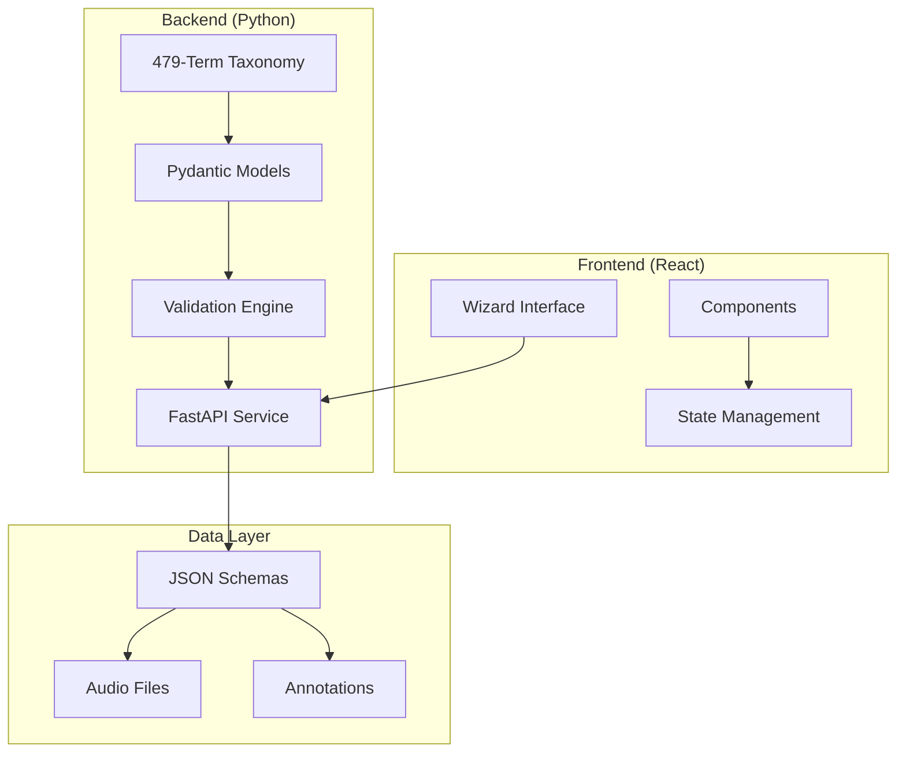

# Audio Description Protocol (ADP)

A Python-first framework for describing musical audio clips with structured text annotations, featuring a comprehensive 479-term taxonomy and interactive React wizard interface for seamless human-AI interoperability.

## 🎯 Project Overview

The Audio Description Protocol (ADP) provides a complete ecosystem for musical audio annotation:

- **479-Term Taxonomy**: Comprehensive mood, energy, and texture descriptors with hierarchical organization
- **Python Backend**: Robust data models, validation, and audio processing with PyTorch/librosa
- **React Wizard Interface**: User-friendly web application for creating annotations step-by-step
- **TypeScript Bridge**: Type-safe data exchange between frontend and backend
- **Time-Based Annotations**: Precise temporal labels with confidence scores and provenance tracking
- **Dataset Management**: Curated collections with manifests and version control

### Key Features

- 🎵 **Comprehensive Taxonomy**: 479 curated terms across mood (147), energy (100), and texture (232) dimensions
- 🐍 **Python-First Architecture**: Core data models and validation using Pydantic with PyTorch integration
- ⚛️ **Interactive Wizard**: React-based web interface with real-time validation and step-by-step annotation creation
- 🔗 **TypeScript Bridge**: Maintains type safety and data consistency between Python backend and React frontend
- 🕒 **Temporal Precision**: Time-range annotations with microsecond accuracy and validation
- 🤖 **Human-AI Interoperability**: Full provenance tracking for annotation sources and confidence scoring
- 📊 **Professional Quality**: Supports musical analysis, spectral features, and hierarchical musical structures
- ⚡ **Real-time Validation**: Immediate feedback with comprehensive error reporting and term suggestions

## 🚀 Quick Start

### Prerequisites

- Python 3.11 or higher
- Node.js 18+ (for React wizard interface)
- Audio files (WAV/MP3/FLAC format)

### Installation

#### Backend Setup
```bash
# Clone the repository
git clone <repository-url>
cd "Audio Description Protocol"

# Create virtual environment
python -m venv venv
source venv/bin/activate  # On Windows: venv\Scripts\activate

# Install Python dependencies
pip install -r requirements.txt
```

#### Frontend Setup (React Wizard)
```bash
# Navigate to wizard application
cd wizard/app

# Install Node.js dependencies
npm install

# Start development server
npm run dev
# Wizard available at http://localhost:5173
```

### Basic Usage

#### Using the Interactive Wizard (Recommended)
```bash
# Start the React wizard interface
cd wizard/app && npm run dev
# Open http://localhost:5173 in your browser
# Follow the step-by-step annotation process
```

#### Programmatic Usage (Python)
```python
from adp_core.models.annotation import Annotation, TimeRange, Label
from adp_core.taxonomy import SemanticAttributes

# Create annotation with taxonomy terms
annotation = Annotation(
    id="my-annotation",
    clip_id="audio-001",
    time_range=TimeRange(start_sec=0.0, end_sec=30.0),
    labels=[Label(entry_id="upbeat", confidence=0.9)],
    # ... other fields
)

# Validate semantic attributes
semantic = SemanticAttributes(
    mood=["upbeat", "joyful"],
    energy=["high-energy"],
    texture=["bright", "crisp"]
)
```

#### Command Line Interface
```bash
# Run tests
pytest tests/

# Check code quality
ruff check src/

# Validate taxonomy terms
python -c "from adp_core.taxonomy import TAXONOMY_TERMS; print(f'Loaded {len(TAXONOMY_TERMS)} taxonomy terms')"
```

## 📖 Project Structure

The codebase is organized into distinct backend and frontend components:

```
📁 Audio Description Protocol/
├── 🐍 src/adp_core/              # Python Backend
│   ├── models/                   # Pydantic data models
│   │   ├── annotation.py         # Core annotation types
│   │   ├── musical_annotation.py # Extended musical analysis
│   │   └── dataset.py           # Dataset management
│   ├── validation/              # Validation framework
│   ├── api/                     # FastAPI web service
│   ├── taxonomy.py              # 479-term taxonomy system
│   ├── taxonomyHelpers.py       # Taxonomy utilities
│   └── typescript_bridge.py     # Frontend type bridge
├── ⚛️ wizard/app/               # React Frontend
│   └── src/                     # React application
│       ├── components/          # UI components
│       ├── context/            # State management
│       ├── types/              # TypeScript definitions
│       └── utils/              # Helper functions
├── 📂 tests/                    # Test suites
│   ├── python/                 # Python backend tests
│   └── e2e/                    # End-to-end tests
├── 📋 schemas/                  # JSON Schema contracts
├── 🗂️ Archived Files/          # Legacy code preservation
├── 🏛️ .specify/                 # Spec Kit framework
└── 📊 PROGRESS.md               # Development history
```

## 🏗️ Architecture

### System Architecture



### Core Components

- **479-Term Taxonomy**: Comprehensive vocabulary covering mood, energy, and texture dimensions
- **Pydantic Models**: Type-safe Python data models with validation
- **React Wizard**: Step-by-step annotation interface with real-time feedback
- **TypeScript Bridge**: Maintains data consistency between frontend and backend
- **Validation Engine**: Multi-level validation ensuring data quality
- **FastAPI Service**: RESTful API for frontend-backend communication

### Data Flow

1. **User Interaction**: React wizard collects annotation data with real-time validation
2. **Type Safety**: TypeScript bridge ensures data consistency across systems
3. **Python Validation**: Backend validates against taxonomy and schema constraints
4. **JSON Export**: Generates ADP-compliant JSON for storage or further processing
5. **Dataset Integration**: Annotations can be aggregated into curated datasets

## 📋 Specification Overview

### Functional Requirements

- **FR-001**: Standardized schemas for dictionary entries
- **FR-002**: Annotation schema with time ranges and confidence
- **FR-003**: Dataset manifest support
- **FR-004**: Model output capture with metadata
- **FR-005**: Comprehensive validation system
- **FR-006**: Lowercase label standardization
- **FR-007**: Provenance tracking (human vs AI)
- **FR-008**: Versioned schema evolution
- **FR-009**: Time range validation
- **FR-010**: Confidence score validation [0.0, 1.0]
- **FR-011**: File path and web URL support
- **FR-012**: Hierarchical label relationships
- **FR-013**: CC0-1.0 default licensing
- **FR-014**: Last-writer-wins conflict resolution

### Scale Requirements

- **Target**: 10,000 audio clips and annotations
- **Performance**: Schema validation <100ms
- **Storage**: File-based JSON with optional database future support

## 🎵 Taxonomy Overview

### 479-Term Classification System

The ADP taxonomy organizes musical descriptors into three main dimensions:

#### **Mood Descriptors (147 terms)**
- **Positive/Uplifting**: upbeat, joyful, triumphant, heroic, optimistic
- **Calm/Peaceful**: peaceful, serene, dreamy, meditative, tranquil
- **Dark/Negative**: melancholic, somber, haunting, ominous, brooding
- **Intense/Aggressive**: aggressive, forceful, explosive, driving
- **Mysterious/Ambiguous**: mysterious, enigmatic, ethereal, atmospheric

#### **Energy Descriptors (100 terms)**
- **High Energy**: high-energy, driving, vigorous, explosive, pumping
- **Medium Energy**: groovy, steady, flowing, balanced, moderate
- **Low Energy**: laid-back, ambient, chill, mellow, peaceful
- **Dynamic Shifts**: building, crescendo, explosive, surging

#### **Texture Descriptors (232 terms)**
- **Bright/Positive**: bright, crisp, sparkling, crystalline, brilliant
- **Warm/Rich**: warm, lush, golden, creamy, honeyed
- **Dark/Heavy**: dark, muddy, thick, dense, weighty
- **Acoustic/Natural**: acoustic, woody, breathy, organic
- **Electronic/Synthetic**: electronic, digital, processed, robotic

### Example Usage
```python
# Semantic annotation using taxonomy terms
semantic_attributes = SemanticAttributes(
    mood=["upbeat", "joyful", "optimistic"],      # Positive mood cluster
    energy=["high-energy", "driving"],           # High energy cluster
    texture=["bright", "crisp", "warm"]          # Mixed texture qualities
)
```

## 🔧 JSON Schema Examples

### Musical Annotation with Taxonomy
```json
{
  "id": "musical-annotation-001",
  "clip_id": "lofi-track-001",
  "annotation_type": "musical",
  "time_range": {
    "start_sec": 0.0,
    "end_sec": 180.0
  },
  "musical_analysis": {
    "tempo": 85,
    "key_signature": "A minor",
    "time_signature": "4/4",
    "semantic_attributes": {
      "mood": ["peaceful", "nostalgic", "dreamy"],
      "energy": ["laid-back", "mellow", "flowing"],
      "texture": ["warm", "soft", "analog"]
    }
  },
  "provenance": {
    "annotator_type": "human",
    "annotator_id": "expert-musicologist",
    "timestamp": "2025-09-29T10:30:00Z"
  },
  "schema_version": "1.0"
}
```

### Dataset with Taxonomy Integration
```json
{
  "id": "chill-hop-dataset",
  "name": "Chill Hip-Hop Collection",
  "version": "1.0",
  "clips": [...],
  "annotations": [...],
  "metadata": {
    "total_duration_sec": 7200,
    "annotation_count": 150,
    "taxonomy_coverage": {
      "mood_terms": 45,
      "energy_terms": 12,
      "texture_terms": 38
    }
  }
}
```

## 🛠️ Development Status

### Current Phase: Core Implementation Complete ✅

- [x] **Python Backend**: Complete taxonomy system with 479 terms and Pydantic models
- [x] **React Wizard**: Fully functional step-by-step annotation interface
- [x] **TypeScript Bridge**: Type-safe data exchange between frontend and backend
- [x] **Validation Framework**: Multi-level validation with real-time feedback
- [x] **Test Coverage**: Comprehensive test suites for Python and TypeScript components
- [x] **Documentation**: Complete architecture and usage documentation
- [x] **Codebase Cleanup**: Archived legacy files and established clean separation

### Recent Achievements (September 2025)

- **Session 9**: Enhanced visual styling and UI polish for wizard interface
- **Session 8**: Complete wizard context and state management implementation
- **Session 7**: React wizard application with TypeScript integration
- **Sessions 4-6**: 479-term taxonomy system and Python backend validation
- **Codebase Cleanup**: Organized archive structure preserving development history

### Current Capabilities

- ✅ **Interactive Annotation Creation**: Full wizard workflow from audio metadata to semantic descriptions
- ✅ **Real-time Validation**: Immediate feedback on taxonomy term usage and data constraints
- ✅ **Professional Quality**: Musical analysis, instrumentation details, and spectral features
- ✅ **Type Safety**: End-to-end type checking from React UI to Python backend
- ✅ **Export Ready**: Generates ADP-compliant JSON for dataset integration

## 🏛️ Project Governance

This project follows constitutional principles defined in `.specify/memory/constitution.md`:

### Core Principles

- **Python + PyTorch First**: Primary technology stack
- **Spec-First Development**: Requirements before implementation
- **JSON Schema Compliance**: Strict contract validation
- **Library-First Modularity**: Reusable components before interfaces
- **Test-Driven Delivery**: Tests written before implementation

### Development Workflow

1. **Specification** → Requirements and user stories
2. **Planning** → Technical design and architecture
3. **Tasks** → Implementation breakdown
4. **Implementation** → Code development following TDD
5. **Validation** → Testing and quality assurance

## 🤝 Contributing

### Getting Started

1. Read the [Constitution](.specify/memory/constitution.md) for project principles
2. Review the [Feature Specification](specs/001-create-a-spec/spec.md)
3. Check the [Implementation Plan](specs/001-create-a-spec/plan.md)
4. Follow the [Task List](specs/001-create-a-spec/tasks.md) for current work

### Development Guidelines

- Follow test-driven development (TDD)
- Maintain JSON Schema compliance
- Use library-first approach for modularity
- Write tests before implementation
- Document all changes with rationale

### Branch Structure

- `main`: Stable releases
- `004-make-all-attribute`: Current feature branch with complete wizard implementation
- `Cleaning-Codebase`: Recent cleanup branch (archived legacy TypeScript files)

## 📄 License

Default dataset license: **CC0-1.0** (Creative Commons Public Domain)

- Ensures maximum reusability and open science alignment
- No PII or sensitive data in annotations
- Provenance tracking for human vs AI contributions

## 📞 Support & Documentation

- **Tutorial**: Comprehensive architecture guide in `tutorial.md`
- **Python API**: Review `src/adp_core/` for backend models and validation
- **React Components**: Check `wizard/app/src/` for frontend implementation
- **Taxonomy Reference**: Explore `src/adp_core/taxonomy.py` for 479-term vocabulary
- **JSON Schemas**: Find contracts in `schemas/` directory
- **Progress Tracking**: Monitor `PROGRESS.md` for development history
- **Legacy Files**: Historical code preserved in `Archived Files/` with documentation

## 🔮 Future Roadmap

- **Phase 1** ✅: Core Python backend with 479-term taxonomy
- **Phase 2** ✅: React wizard interface with real-time validation
- **Phase 3**: Advanced audio processing and ML model integration
- **Phase 4**: API service deployment and collaborative annotation
- **Phase 5**: Dataset marketplace and community features
- **Phase 6**: Performance optimization and enterprise scaling

## 🎯 Getting Started Quickly

### For Researchers & Annotators
1. **Use the Wizard**: `cd wizard/app && npm run dev` → Open http://localhost:5173
2. **Follow the Steps**: Audio metadata → Genre → Semantic attributes → Export JSON
3. **Validate Results**: Comprehensive real-time feedback ensures quality

### For Developers
1. **Explore the Taxonomy**: `python -c "from adp_core.taxonomy import TAXONOMY_TERMS; print(len(TAXONOMY_TERMS))"`
2. **Run Tests**: `pytest tests/python/` for backend, `cd wizard/app && npm test` for frontend
3. **Read the Tutorial**: Complete architecture overview in `tutorial.md`

### For AI/ML Practitioners
1. **Review Data Models**: Check `src/adp_core/models/` for annotation structures
2. **Understand Taxonomy**: 479 curated terms for consistent model training
3. **Export Datasets**: Use wizard or programmatic interface for dataset creation

---

**Status**: Core implementation complete, production ready for annotation workflows
**Architecture**: Python backend + React frontend with 479-term taxonomy
**Last Updated**: 2025-09-29 (Codebase Cleanup Complete)