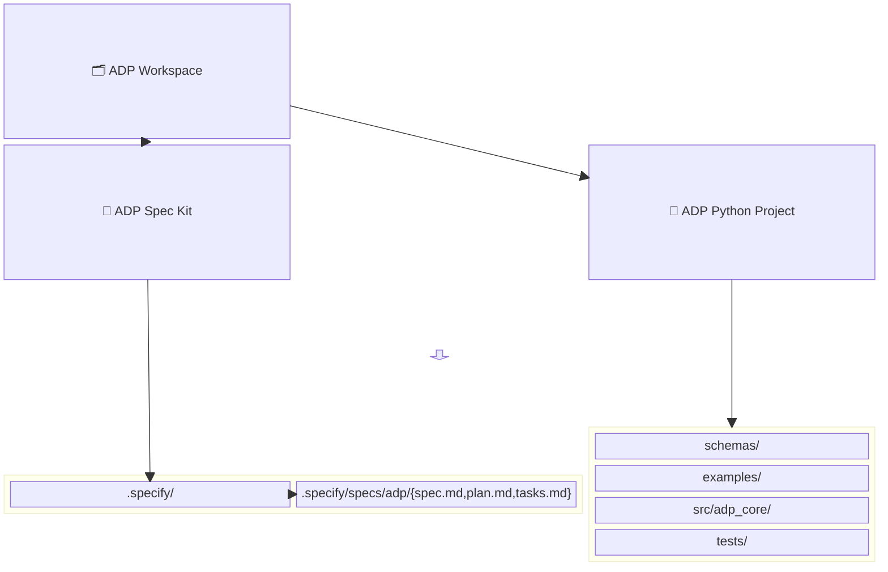

# Feature Specification: ADP Core Protocol

**Feature Branch**: `[001-adp-core]`  
**Created**: 2025-09-24  
**Status**: Draft  
**Input**: User description: "Create a spec-driven framework (Audio Description Protocol, ADP) for describing musical audio clips with text so humans ⟷ AIs can interoperate. Include dictionary labels, annotations with time ranges/confidence, dataset manifests, and model outputs. Python+PyTorch preferred."

## Execution Flow (main)
```
1. Parse user description from Input
   → If empty: ERROR "No feature description provided"
2. Extract key concepts from description
   → Identify: actors (annotator, model, researcher, app), actions (label, validate, train, infer), data (dictionary entry, annotation, dataset, model output), constraints (JSON schema, CC0, provenance)
3. For each unclear aspect:
   → Mark with [NEEDS CLARIFICATION: specific question]
4. Fill User Scenarios & Testing section
   → If no clear user flow: ERROR "Cannot determine user scenarios"
5. Generate Functional Requirements
   → Each requirement must be testable
   → Mark ambiguous requirements
6. Translate constitutional obligations into operational requirements (CLI, telemetry, release readiness)
   → Note CLI entrypoints and text I/O formats
   → Identify required metrics/logging and release note items
7. Identify Key Entities (if data involved)
8. Run Review Checklist
   → If any [NEEDS CLARIFICATION]: WARN "Spec has uncertainties"
   → If implementation details found: ERROR "Remove tech details"
9. Return: SUCCESS (spec ready for planning)
```

---

## 📊 Code Structure Diagram



---

## Quick Guidelines
- ✅ Focus on WHAT/WHY, not implementation details.
- 👥 Audience: stakeholders + engineers.
- 📡 Include CLI touchpoints, telemetry, and release expectations per constitution.

## User Scenarios & Testing *(mandatory)*

### Primary User Story
An annotator labels an audio clip using the ADP dictionary and exports a valid `annotation.json` that downstream tools (including AI) can consume.

### Acceptance Scenarios
1. **Given** a valid dictionary entry and a clip id, **When** the annotator submits a label with confidence and time range, **Then** the system emits a schema-valid `annotation.json`.
2. **Given** a set of annotations and clip refs, **When** a dataset manifest is generated, **Then** the `dataset.json` validates and cross-references existing IDs.

### Edge Cases
- Time ranges where `end_sec <= start_sec` → validation must fail.
- Confidence outside `[0.0, 1.0]` → validation must fail.
- Missing dictionary entry ids → validation must fail.

## Requirements *(mandatory)*

### Functional Requirements
- **FR-001**: Must define **dictionary.entry** schema with `label`, `definition`.
- **FR-002**: Must define **annotation** schema with `clip_id`, `time_range`, `labels[*].confidence`.
- **FR-003**: Must define **dataset** schema that references clips, annotations, and optional dictionary entries.
- **FR-004**: Must define **model.output** as annotation + `inference_meta`.
- **FR-005**: CLI must validate files against specific schemas.
- **FR-006**: Unit tests must cover valid/invalid examples.

Ambiguities:
- **FR-007**: [NEEDS CLARIFICATION: minimum fields for `clip.ref` in Phase 2—uri vs path vs hash?]
- **FR-008**: [NEEDS CLARIFICATION: baseline ontology relations in v0.1 or defer to extension?]

- **FR-009**: Annotation labels **MUST** be lowercase ASCII tokens.
  - Allowed chars: `a–z`, digits, space, hyphen
  - Regex: `^[a-z0-9]+(?:[- ][a-z0-9]+)*$`
  - Rationale: prevents duplicates like `Dark` vs `dark`; keeps descriptors consistent (e.g., `lo-fi`, `very dark`).
  - Acceptance:
    - ✅ `dark`, `lo-fi`, `very dark`
    - ❌ `Dark`, `Lo-Fi`, `moody!`

- **FR-010**: Dictionary `definition` **MUST** be a non-empty string of at least 10 characters.
  - Rationale: ensures useful, descriptive entries rather than single words.
  - Acceptance:
    - ✅ "Moody, low-fidelity aesthetic with subdued energy."
    - ❌ "moody"

- **FR-011**: `schema_version` **MUST** follow semantic versioning `MAJOR.MINOR[.PATCH]`.
  - Regex: `^[0-9]+\.[0-9]+(\.[0-9]+)?$`
  - Rationale: consistent versioning across all ADP documents and schemas.
  - Acceptance:
    - ✅ `0.1`, `1.0.3`
    - ❌ `v1.0`, `1`, `1.0-beta`


- **FR-012**: Dictionary `id` **MUST** be lowercase kebab-case.
  - Regex: `^[a-z0-9]+(?:-[a-z0-9]+)*$`
  - Rationale: stable, URL/file-friendly identifiers; avoids spaces/underscores/uppercase.
  - Acceptance:
    - ✅ `dark-001`, `lofi-texture`, `driving`
    - ❌ `Dark-001`, `lofi_texture`, `lofi texture`


### Operational Requirements *(mandatory)*
- **OP-001**: Provide CLI command `adp validate <file> --schema <name>` with stdout OK/ERR and non-zero exit on failure.
- **OP-002**: Emit structured logs (JSON lines) for validations (timestamp, schema, result, error_count).
- **OP-003**: Maintain release notes with semantic version increments when schemas change; include migration notes.
- **OP-004**: Default license CC0; forbid PII in free-text; provenance must state human/AI.

### Key Entities
- **DictionaryEntry**: id, label, definition, aliases[], tags[].
- **Annotation**: id, clip_id, time_range{start_sec,end_sec}, labels[{entry_id,confidence}], free_text?, provenance?.
- **Dataset**: id, name, split, arrays of clip refs, annotations, dictionary entries.
- **ModelOutput**: Annotation + inference_meta{model_name, model_version, time_ms, hardware?}.

---

## Review & Acceptance Checklist
- [ ] Mandatory sections completed; no implementation details leaked.
- [ ] Functional requirements are testable and unambiguous.
- [ ] Operational requirements map to CLI/logging/release work.
- [ ] All [NEEDS CLARIFICATION] items recorded under Clarifications.
- [ ] Success criteria defined in scenarios.

---

## Execution Status
- [ ] User description parsed
- [ ] Key concepts extracted
- [ ] Ambiguities marked
- [ ] User scenarios defined
- [ ] Requirements generated
- [ ] Entities identified
- [ ] Review checklist passed

---

## Clarifications
### Session 2025-09-24
- Confidence must be present for each label; time in seconds (float).
- Default license is CC0 unless otherwise declared.
- Open: minimal `clip.ref` fields; minimal ontology in v0.1 vs extension.
