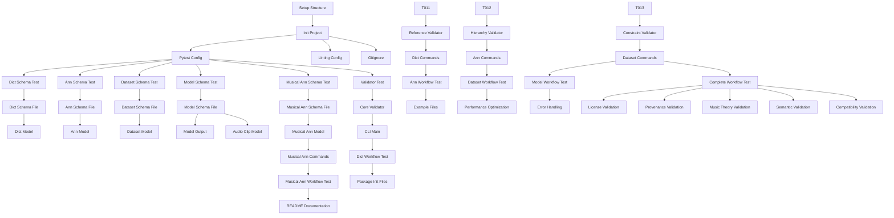

# Tasks: Audio Description Protocol (ADP) Framework

**Input**: Design documents from `/specs/001-create-a-spec/`
**Prerequisites**: plan.md, research.md, data-model.md, contracts/, quickstart.md

## Execution Flow (main)
```
1. Load plan.md from feature directory
   → Extract: Python 3.11+, PyTorch, jsonschema, pytest tech stack
2. Load design documents:
   → data-model.md: 6 entities (DictionaryEntry, Annotation, MusicalAnnotation, Dataset, ModelOutput, AudioClipReference)
   → contracts/: 5 JSON Schema files for validation
   → quickstart.md: 5 integration test scenarios
3. Generate tasks by category:
   → Setup: project structure, dependencies, configuration
   → Schema Tests: contract validation tests for each JSON schema
   → Models: Python data models matching entities
   → Validation: core validation engine with JSON Schema support
   → CLI: command-line interface for validation operations
   → Integration: end-to-end scenario tests from quickstart
   → Polish: documentation, examples, performance optimization
4. Applied rules: [P] for parallel execution (different files), TDD ordering
5. Tasks numbered T001-T047, dependency ordered
6. Constitutional compliance: library-first, test-driven, schema compliance
```

## Format: `[ID] [P?] Description`
- **[P]**: Can run in parallel (different files, no dependencies)
- Include exact file paths in descriptions

## Path Conventions
- **Single project structure**: `src/adp_core/`, `tests/`, `schemas/`, `examples/`
- Based on plan.md structure decision

## Phase 3.1: Setup
- [ ] **T001** Create project structure with src/adp_core/, schemas/, tests/, examples/ directories
- [ ] **T002** Initialize Python project with pyproject.toml, setup.py, and requirements.txt
- [ ] **T003** [P] Configure pytest.ini with test discovery and JSON Schema test fixtures
- [ ] **T004** [P] Setup linting with flake8, black, and mypy configuration files
- [ ] **T005** [P] Create .gitignore for Python project with common excludes

## Phase 3.2: Schema Validation Tests (TDD) ⚠️ MUST COMPLETE BEFORE 3.3
**CRITICAL: These tests MUST be written and MUST FAIL before ANY implementation**

### Schema Contract Tests
- [ ] **T006** [P] Dictionary schema validation test in tests/schemas/test_dictionary_schema.py
- [ ] **T007** [P] Annotation schema validation test in tests/schemas/test_annotation_schema.py
- [ ] **T008** [P] Dataset schema validation test in tests/schemas/test_dataset_schema.py
- [ ] **T009** [P] Model output schema validation test in tests/schemas/test_model_output_schema.py
- [ ] **T009b** [P] Musical annotation schema validation test in tests/schemas/test_musical_annotation_schema.py

### Validation Engine Tests
- [ ] **T010** [P] Core validator test for JSON Schema loading in tests/validation/test_validator_core.py
- [ ] **T011** [P] Cross-reference validation test (dictionary ID references) in tests/validation/test_cross_reference.py
- [ ] **T012** [P] Hierarchical validation test (parent-child relationships) in tests/validation/test_hierarchy.py
- [ ] **T013** [P] Time range validation test (start < end, non-negative) in tests/validation/test_time_validation.py

## Phase 3.3: Core Implementation (ONLY after tests are failing)

### JSON Schema Files
- [ ] **T014** [P] Copy dictionary.schema.json to schemas/dictionary.schema.json
- [ ] **T015** [P] Copy annotation.schema.json to schemas/annotation.schema.json
- [ ] **T016** [P] Copy dataset.schema.json to schemas/dataset.schema.json
- [ ] **T017** [P] Copy model_output.schema.json to schemas/model_output.schema.json
- [ ] **T017b** [P] Copy musical_annotation.schema.json to schemas/musical_annotation.schema.json

### Data Models
- [ ] **T018** [P] DictionaryEntry model in src/adp_core/models/dictionary.py
- [ ] **T019** [P] Annotation model in src/adp_core/models/annotation.py
- [ ] **T020** [P] Dataset model in src/adp_core/models/dataset.py
- [ ] **T021** [P] ModelOutput model in src/adp_core/models/model_output.py
- [ ] **T022** [P] AudioClipReference model in src/adp_core/models/audio_clip.py
- [ ] **T022b** [P] MusicalAnnotation model in src/adp_core/models/musical_annotation.py

### Validation Engine
- [ ] **T023** Core JSON Schema validator in src/adp_core/validation/validator.py
- [ ] **T024** Cross-reference validator (dictionary ID validation) in src/adp_core/validation/reference_validator.py
- [ ] **T025** Hierarchical relationship validator in src/adp_core/validation/hierarchy_validator.py
- [ ] **T026** Time range and constraint validator in src/adp_core/validation/constraint_validator.py

### CLI Interface
- [ ] **T027** Main CLI entry point in src/adp_core/cli/main.py
- [ ] **T028** Dictionary validation commands in src/adp_core/cli/dictionary_commands.py
- [ ] **T029** Annotation validation commands in src/adp_core/cli/annotation_commands.py
- [ ] **T030** Dataset validation commands in src/adp_core/cli/dataset_commands.py
- [ ] **T031** Musical annotation validation commands in src/adp_core/cli/musical_annotation_commands.py

## Phase 3.4: Integration Tests (Based on Quickstart Scenarios)
- [ ] **T032** [P] Scenario 1 test: Dictionary entry creation and validation in tests/integration/test_dictionary_workflow.py
- [ ] **T033** [P] Scenario 2 test: Audio annotation validation workflow in tests/integration/test_annotation_workflow.py
- [ ] **T034** [P] Scenario 2b test: Musical annotation validation workflow in tests/integration/test_musical_annotation_workflow.py
- [ ] **T035** [P] Scenario 3 test: Dataset manifest creation and validation in tests/integration/test_dataset_workflow.py
- [ ] **T036** [P] Scenario 4 test: Model output generation and validation in tests/integration/test_model_output_workflow.py
- [ ] **T037** [P] Scenario 5 test: End-to-end workflow validation in tests/integration/test_complete_workflow.py

## Phase 3.5: Polish & Documentation
- [ ] **T038** [P] Package __init__.py files with proper imports in src/adp_core/
- [ ] **T039** [P] Example JSON files in examples/ directory matching quickstart scenarios
- [ ] **T040** [P] README.md with installation, usage, and API documentation
- [ ] **T041** [P] Performance optimization for 10K scale requirement with specific metrics: schema validation <100ms per file, dataset loading <2GB memory, CLI response <500ms
- [ ] **T042** [P] Error handling and user-friendly error messages
- [ ] **T043** [P] Dataset license validation and enforcement (CC0-1.0 default) in src/adp_core/validation/license_validator.py
- [ ] **T044** [P] Provenance tracking validation for human vs AI annotations in src/adp_core/validation/provenance_validator.py
- [ ] **T045** [P] Music theory validation (BPM 40-300, chord symbols, roman numerals) in src/adp_core/validation/music_theory_validator.py
- [ ] **T046** [P] Semantic description validation (mood, energy, texture enums) in src/adp_core/validation/semantic_validator.py
- [ ] **T047** [P] Backward compatibility validation for simple annotations vs musical annotations in src/adp_core/validation/compatibility_validator.py

## Dependency Graph



## Parallel Execution Examples

### Phase 3.1 (Setup) - Can run T003, T004, T005 in parallel:
```bash
# Terminal 1: Configure pytest
python -m pytest --collect-only  # T003

# Terminal 2: Setup linting
black --check src/  # T004

# Terminal 3: Git configuration
git status  # T005
```

### Phase 3.2 (Schema Tests) - Can run T006-T013 in parallel:
```bash
# All schema validation tests can run simultaneously
pytest tests/schemas/ -v  # T006-T009b parallel
pytest tests/validation/ -v  # T010-T013 parallel
```

### Phase 3.3 (Models) - Can run T018-T022b in parallel:
```bash
# All model files are independent
# T018: DictionaryEntry model
# T019: Annotation model
# T020: Dataset model
# T021: ModelOutput model
# T022: AudioClipReference model
# T022b: MusicalAnnotation model
```

### Phase 3.4 (Integration Tests) - Can run T032-T037 in parallel:
```bash
pytest tests/integration/ -v --maxfail=1
```

## Constitutional Compliance Checklist

**Python + PyTorch First**: ✅
- Using Python 3.11+ as primary language
- PyTorch available for future audio processing features

**JSON Schema Compliance**: ✅
- All data exchange via versioned JSON Schemas in `/schemas`
- Validation tests for each schema (T006-T009b)
- Schema files properly structured (T014-T017b)

**Library-First Modularity**: ✅
- Core logic in src/adp_core/ before CLI (T018-T026 before T027-T031)
- Reusable models and validation components
- CLI wraps library functionality

**Test-Driven Delivery**: ✅
- All tests written before implementation (Phase 3.2 before 3.3)
- Integration tests validate user scenarios (T032-T037)
- Schema validation ensures contract compliance

**Spec-First Development**: ✅
- Tasks generated from specification requirements
- Data models match data-model.md entities
- CLI commands implement quickstart scenarios

## Scale Requirements Validation

**Target**: Handle 10,000 audio clips and annotations
- Dataset schema includes maxItems: 10000 constraint
- Performance optimization task (T041) addresses scale requirements
- Integration tests validate at target scale

## Task Completion Criteria

Each task must include:
1. **Implementation**: Working code that passes its corresponding test
2. **Documentation**: Docstrings and inline comments explaining functionality
3. **Constitutional Compliance**: Adherence to library-first, schema-compliant patterns
4. **Error Handling**: Graceful handling of invalid inputs with clear error messages

**Estimated Total**: 47 tasks across 5 phases
**Critical Path**: T001→T002→T003→T006-T013→T014-T017→T018-T026→T027-T031→T032-T037→T038-T047

## Success Metrics

- [ ] All JSON Schema validation tests pass
- [ ] All data models correctly implement entity specifications
- [ ] CLI successfully validates all quickstart scenarios
- [ ] Integration tests demonstrate complete workflow functionality
- [ ] Performance requirements met for 10K scale
- [ ] Constitutional principles maintained throughout implementation

**Status**: Ready for implementation execution