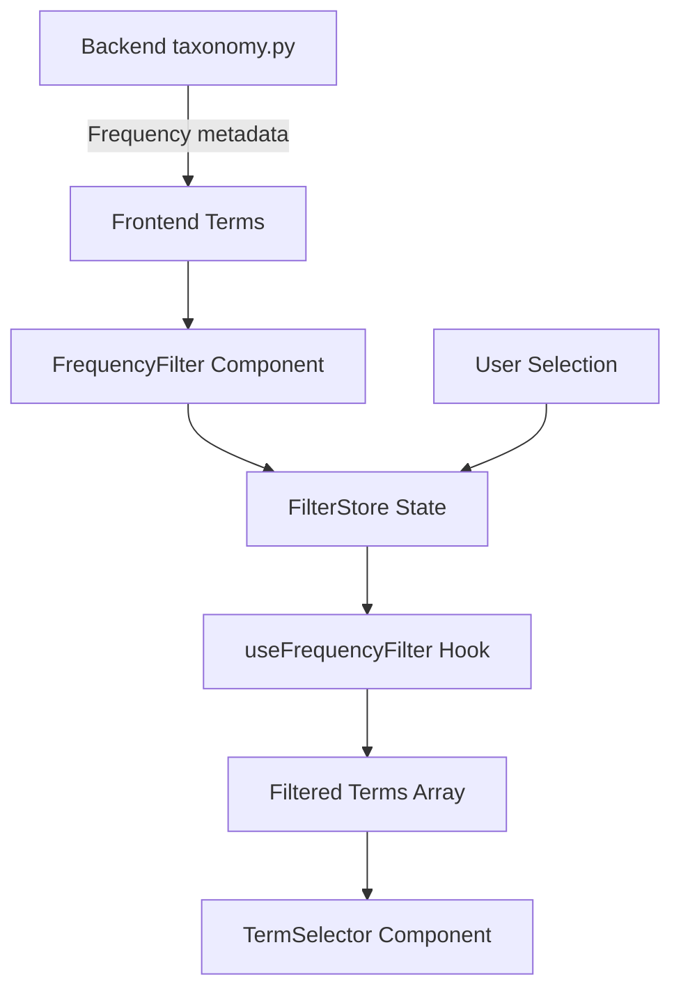

# Data Model: Frequency Filter

**Feature**: Add Frequency Filter Toolbar
**Date**: 2025-01-29
**Status**: Complete

## Type Definitions

### FrequencyCategory
```typescript
type FrequencyCategory = 'all' | 'ubiquitous' | 'frequent' | 'infrequent' | 'rare';
```

**Description**: Union type representing all possible filter options. Maps to Python Frequency enum with addition of 'all' for unfiltered view.

**Validation Rules**:
- Must be one of the five defined string literals
- Default value: 'all'

### FilterState
```typescript
interface FilterState {
  selectedFrequency: FrequencyCategory;
}
```

**Description**: Global state shape for frequency filter

**Field Definitions**:
- `selectedFrequency`: Currently selected filter option

**State Transitions**:
- Initial → 'all'
- Any → Any (user can switch freely between options)

### Term
```typescript
interface Term {
  value: string;
  frequency?: FrequencyCategory; // Excluding 'all'
}
```

**Description**: Enhanced term structure with frequency metadata

**Field Definitions**:
- `value`: The term string to display
- `frequency`: Optional frequency classification from backend

**Validation Rules**:
- `frequency` cannot be 'all' (that's filter-only)
- Missing `frequency` means term appears only when filter is 'all'

### FilterAvailability
```typescript
type FilterAvailability = Map<FrequencyCategory, {
  available: boolean;
  count: number;
  label: string;
}>;
```

**Description**: Tracks which filter options have matching terms

**Field Definitions**:
- `available`: Whether this frequency has any terms
- `count`: Number of terms in this frequency
- `label`: Display label (e.g., "No rare Available" when count=0)

## Component Props Interfaces

### FrequencyFilterProps
```typescript
interface FrequencyFilterProps {
  terms: Term[];
  className?: string;
}
```

**Description**: Props for the FrequencyFilter component

**Field Definitions**:
- `terms`: Array of terms with frequency metadata
- `className`: Optional CSS classes for styling

### FilteredTermSelectorProps
```typescript
interface FilteredTermSelectorProps extends TermSelectorProps {
  terms: string[]; // Already filtered
}
```

**Description**: Props passed to TermSelector after filtering

## Store Interface

### FilterStore
```typescript
interface FilterStore {
  // State
  selectedFrequency: FrequencyCategory;

  // Actions
  setFrequency: (frequency: FrequencyCategory) => void;
  resetFilter: () => void;

  // Computed
  isFiltered: () => boolean;
}
```

**Description**: Zustand store interface for filter state management

**Methods**:
- `setFrequency`: Update selected filter
- `resetFilter`: Return to 'all' filter
- `isFiltered`: Check if filter is active (not 'all')

## Hook Interfaces

### UseFrequencyFilter
```typescript
interface UseFrequencyFilterResult {
  selectedFrequency: FrequencyCategory;
  setFrequency: (frequency: FrequencyCategory) => void;
  filterTerms: (terms: Term[]) => string[];
  getAvailability: (terms: Term[]) => FilterAvailability;
}
```

**Description**: Hook return type for filter logic

**Methods**:
- `filterTerms`: Apply current filter to term array
- `getAvailability`: Calculate which filters have terms

## Data Flow



## Persistence

### Session Storage Schema
```typescript
interface StoredFilterState {
  version: '1.0.0';
  selectedFrequency: FrequencyCategory;
  lastUpdated: string; // ISO timestamp
}
```

**Key**: `adp-frequency-filter`

**Migration Strategy**:
- Version check on load
- Reset to default if version mismatch

---
*Data model complete. Ready for implementation.*